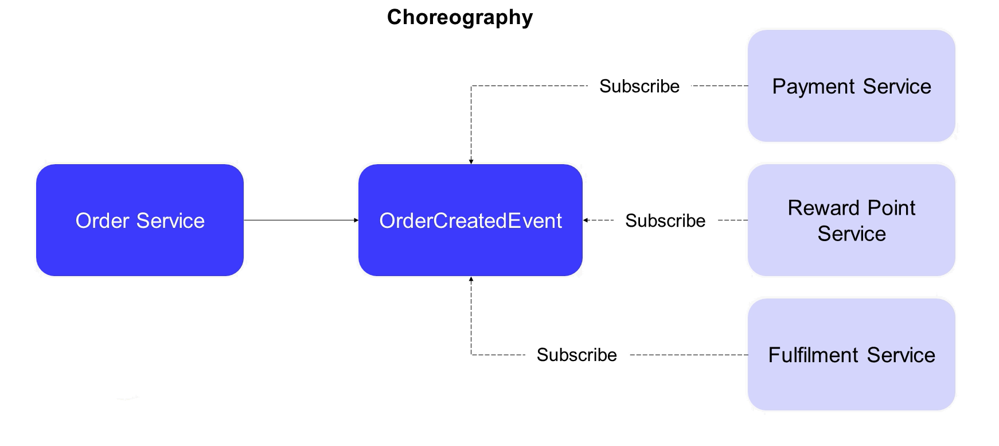

Spring-Boot driven microservice architecture based solution.

General tech stack used:
- Spring Boot
- Spring Cloud Netflix
- PostgreSql
- Hibernate
- Apache Kafka + Zookeeper + Kafka UI
- Prometheus Micrometer
- Docker
- Swagger

This solution could serve as a template for an online shop, where workflow can be presented
as a chain of [Client Authorization -> Placing order -> Payment -> Inventory -> Delivery] processes
and where each one is being deployed at its own server. Communication is being established with Apache Kafka,
the communication pattern is Saga Choreography.




The project contains the following subprojects: 

1. Gateway-service
2. Discovery-service (combined with Config-service)
3. Auth-service
4. Order-service
5. Payment-service
6. Inventory-service
7. Delivery-service

This project is Choreography SAGA-pattern driven. 


## Environment

To run PostgreSQL with Kafka you have to execute the command in project root Report-service:

docker-compose up -d


Also, you have convenient [UI for Apache Kafka](https://github.com/provectus/kafka-ui) at URL

http://localhost:9999/

Now you can run application services from your IDE in this order 
- Discovery
- Auth-service
- Order-service
- Payment-service
- Inventory-service
- Delivery-service
- Gateway-service

At Gateway, you can find joined Swagger UI.
http://localhost:9090/swagger-ui.html

Or alternatively
Try doing requests with Postman app.


## Basic interactions

You can use those curl commands, or you can do all that with Swagger UI

### Authentication

To create user use this request to auth service 
```bash
curl -X 'POST' \
  'http://localhost:8083/auth/user/signup' \
  -H 'accept: */*' \
  -H 'Content-Type: application/json' \
  -d '{
  "name": "some_user",
  "password": "some_pass"
}'
```

After that you can get a token
```bash
curl -X 'POST' \
  'http://localhost:8083/auth/auth/token/generate' \
  -H 'accept: */*' \
  -H 'Content-Type: application/json' \
  -d '{
  "name": "some_user",
  "password": "some_pass"
}'
```

Now you can use this token to authenticate requests to other service

### Order service

To create an order you can send POST request:

```bash
curl -X 'POST' \
  'http://localhost:9090/api/order' \
  -H 'accept: */*' \
  -H 'Content-Type: application/json' \
  -H 'Bearer <put token here>'
  -d '{
  "description": "string",
  "departureAddress": "string",
  "destinationAddress": "string",
  "cost": 0,
  "amount": 2
}'
```

You can list orders with GET request:

```bash
curl -X 'GET' \
  'http://localhost:9090/api/order' \
  -H 'accept: */*' \
  -H 'Bearer <put token here>'
```


Also you can change status of order with PATCH request:

```bash
curl -X 'PATCH' \
  'http://localhost:8080/api/order/1' \
  -H 'accept: */*' \
  -H 'Content-Type: application/json' \
  -H 'Bearer <put token here>'
  -d '{
  "status": "REGISTERED",
  "serviceName": "ORDER_SERVICE",
  "comment": "Some comment to status"
}'
```
### Payment service

To top up the balance of a logged-in user send POST request:

http://localhost:8084/topup?amount=5000
**here choose the amount you would like to top up the account with


### Inventory service


To top up the stock with a new (or existing) item you can send POST request:

```bash
curl -X 'POST' \
  'http://localhost:8085/topupstock' \
  -H 'accept: */*' \
  -H 'Content-Type: application/json' \
  -H 'Bearer <put token here>'
  -d '{
  "itemName": "beer",
  "price": 50,
  "amount": 20
}'
```

## Running metrics tools with docker-compose
You can also implement Prometheus micrometer-driven metrics convenient service
change root directory with "cd metrics", then

docker-compose up


